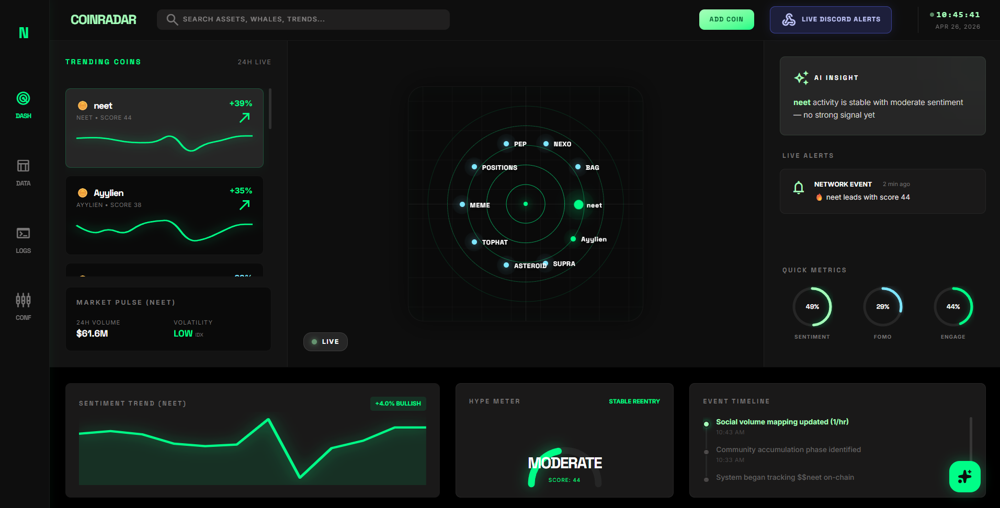
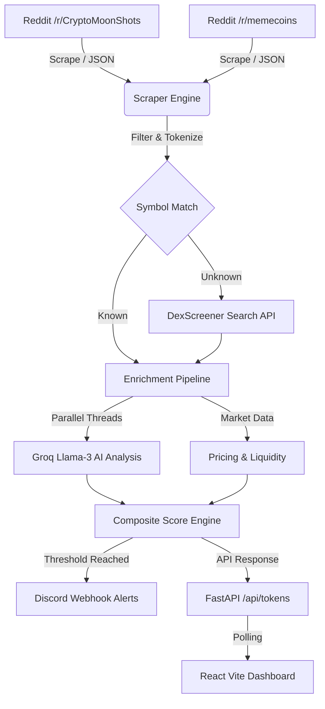

# 📡 CoinRadar: Real-Time Meme Coin Intelligence



> **Predict the hype, track the whales, and ride the moon.**  
> CoinRadar is a high-performance intelligence terminal designed to identify breakout meme coins before they go parabolic.

[](https://www.python.org/)
[](https://fastapi.tiangolo.com/)
[](https://react.dev/)
[](https://vitejs.dev/)
[](https://groq.com/)
[](LICENSE)

---

## 🚀 Key Features

*   **⚡ Parallel Enrichment Pipeline:** Processes 10+ coins concurrently via DexScreener and social data in < 8 seconds.
*   **🧠 AI Sentiment Synthesis:** Leveraging Groq's Llama-3 for real-time natural language analysis of social hype.
*   **📡 Radar Visualization:** Interactive, real-time "ping" dashboard showing market momentum and breakout risk.
*   **🚨 Multi-Signal Alerts:** Composite trigger engine (Sentiment + Mention Spike + Momentum) with Discord integration.
*   **🛡️ Windows-Safe Engine:** Fully optimized backend with ASCII-safe logging for terminal stability on any OS.

---

## 🛠️ Technical Architecture



---

## 📂 Project Structure

```text
CoinRadar/
├── assets/                  # Documentation assets (Hero images, etc.)
├── backend/                 # FastAPI / Python backend
│   ├── main.py              # Entry point & CORS/API config
│   ├── scraper.py           # Multi-threaded Reddit & DexScreener engine
│   ├── intelligence.py      # VADER sentiment & Groq AI synthesis
│   ├── .env                 # API keys (GROQ_API_KEY, DISCORD_WEBHOOK_URL)
│   └── requirements.txt     # Python dependencies
└── frontend/                # React Vite frontend
    ├── src/
    │   ├── components/      # RadarCore, TopBar, DataModule, etc.
    │   ├── hooks/           # useTokenData custom live-data hook
    │   └── App.jsx          # Main dashboard logic
    ├── tailwind.config.js   # Premium SaaS styling config
    └── package.json         # Node dependencies
```

---

## 🛠️ Installation & Setup

### 1. Backend Setup
```bash
cd backend
python -m venv venv
source venv/Scripts/activate  # Windows
pip install -r requirements.txt
```
Create a `.env` file from `.env.example` and add your `GROQ_API_KEY` and `DISCORD_WEBHOOK_URL`.

```bash
uvicorn main:app --reload --port 8001
```

### 2. Frontend Setup
```bash
cd frontend
npm install
npm run dev
```

---

## 👥 The Team

We are a group of developers passionate about high-performance data pipelines and AI-driven market intelligence.

1.  **Sri Hari Nikesh S S** - [sriharinikeshss](https://github.com/sriharinikeshss)
2.  **Pravin Balaji R** - [PravinbalajiR](https://github.com/PravinbalajiR)
3.  **Vishal D** - [V-I-S-HAL](https://github.com/V-I-S-HAL)

---

## 📝 License

This project is licensed under the **MIT License**. See the [LICENSE](LICENSE) file for more details.
